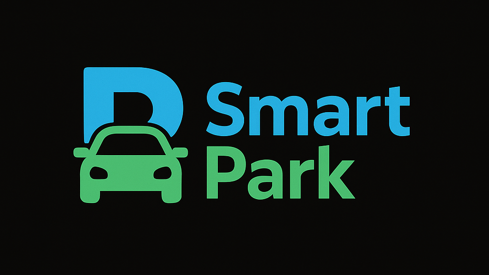

# 🚗 SmartPark – Parking Automation System



SmartPark is an intelligent parking automation solution that modernizes traditional parking processes by automating vehicle entry/exit, integrating seamless WhatsApp-based payments, and providing real-time vehicle tracking. Designed with scalability and convenience in mind, SmartPark eliminates queues, reduces manual errors, and brings a cashless, digital-first experience to everyday parking.

---

> ⚠️ **IMPORTANT NOTE**

🧑‍✈️ This website is **intended to be used only by the parking gatekeeper**.

🚗 Drivers **do not interact with the system directly**. There is **no user-facing interface or login** for drivers.

💬 All driver actions happen via **WhatsApp and SMS**, where they receive a **payment link** automatically.

🛠️ This is a **fully backend-powered automation system** focused on reducing human involvement and minimizing entry/exit delays.

✅ Ideal for private, commercial, or apartment parking lots where gatekeepers handle entry while drivers enjoy a seamless, contactless payment experience.

---

## 📌 Key Features

- **Automated Entry/Exit**: Entry gate opens automatically upon payment confirmation.
- **Real-Time Payment Integration**: WhatsApp-based payment links sent via Gupshup API.
- **Overtime Detection**: System auto-detects extended parking and requests overtime payment.
- **ANPR Support**: License plate recognition using Python and OpenCV.
- **Admin Dashboard**: View vehicle logs, filter by date/type, monitor revenues.
- **Minimal Human Interaction**: Everything happens digitally and remotely.

---

## 🧱 Tech Stack

- **Frontend**: Next.js (TypeScript), Tailwind CSS
- **Backend**: Node.js, Express.js
- **Database**: MongoDB
- **Messaging & Payment**: Gupshup WhatsApp API, RazorPay API
- **ANPR**: Python (OpenCV, EasyOCR)
- **Dev Tools**: Postman, Git

---

## 🏁 How It Works – SmartPark Automated Flow

1. **Vehicle Arrives at Entry Gate**  
   The driver approaches the parking gate and shares their phone number and intended parking duration with the gatekeeper.

2. **Automatic Number Plate Recognition (ANPR)**  
   The system scans the vehicle’s number plate using a Python-based ANPR module (OCR + OpenCV) to automatically capture the vehicle number.

3. **Gatekeeper Logs Entry**  
   After entering the phone number, duration, and confirming the ANPR-detected plate, the gatekeeper submits the entry.

4. **Gate Opens Immediately**  
   As soon as the entry is logged, the entry gate opens automatically, allowing the vehicle to move in without waiting.

5. **Payment Message Sent in Real-Time**  
   Simultaneously, the driver receives:

   - A **WhatsApp message** (via Gupshup API) with a unique payment link.
   - An **SMS** as backup containing the same link.

6. **Driver Can Pay Anytime Before Exiting**  
   The driver can complete the payment at their convenience—either immediately or before their allotted duration ends.

7. **Exit Gate Behavior Based on Payment**

   - If **payment is already done**, the exit gate opens automatically when the ANPR system detects the vehicle.
   - If **payment is pending**, the system:
     - Sends a new WhatsApp message with an updated bill including the full parking duration.
     - Offers a **"Pay Later"** option in case of overtime.

8. **“PAY” Command for Final Billing**  
   If the driver has stayed longer than the chosen duration, they can send the word **“PAY”** to the same WhatsApp number. This triggers:
   - A final bill combining the original + extra time charges.
   - A new payment link that must be used just before approaching the exit gate to avoid delays.

> 💡 This system ensures instant gate operations, minimal entry delays, and a smooth, self-service exit process, enhancing both user convenience and parking lot efficiency.

---

## 📦 MongoDB Parking Schema – Explained

This Mongoose schema stores each parking session, capturing both the initial entry and the full lifecycle of the vehicle inside the lot.

### ✅ Fields Overview

| Field              | Type    | Description                                                       |
| ------------------ | ------- | ----------------------------------------------------------------- |
| `vehicleNo`        | String  | The license plate number detected via ANPR                        |
| `vehicleType`      | String  | Type of vehicle (e.g., car, bike, truck)                          |
| `phone`            | String  | Driver's phone number used to send payment links via WhatsApp/SMS |
| `parkingDuration`  | Number  | Duration (in hours) initially selected by the driver              |
| `entryTime`        | Date    | Timestamp when the vehicle entered the parking lot                |
| `exitTime`         | Date    | Timestamp when the vehicle left (set later at exit)               |
| `paymentStatus`    | String  | `"pending"` or `"paid"` – reflects whether payment is completed   |
| `paymentLinkId`    | String  | Identifier for the payment link sent via Gupshup API              |
| `totalAmount`      | Number  | Final charge based on duration and overtime (if any)              |
| `notificationSent` | Boolean | Tracks whether payment notification has been sent to the user     |
| `firstPayment`     | Boolean | Indicates whether initial payment was made before overtime        |
| `updatedDuration`  | Number  | Updated total parking duration (initial + extra if overstayed)    |
| `extraDuration`    | Number  | Additional duration (in hours) beyond original parking time       |

---

### 🔄 Lifecycle Behavior

**Entry**

- Fields populated: `vehicleNo`, `vehicleType`, `phone`, `parkingDuration`, `entryTime`
- Auto-calculated: `updatedDuration` defaults to `parkingDuration`

**During Parking**

- Notification logic checks `notificationSent`
- Payment status updates to `"paid"` after success

**Exit**

- `exitTime` is logged
- If overstayed:
  - `extraDuration` is calculated
  - `updatedDuration = parkingDuration + extraDuration`
  - `totalAmount` recalculated
  - WhatsApp **"PAY"** command triggers new link and updates schema

---

### 🧠 Hook Logic

```js
parkingSchema.pre("save", function (next) {
  if (!this.updatedDuration) {
    this.updatedDuration = this.parkingDuration;
  }
  next();
});
```

> This ensures the `updatedDuration` is always at least equal to the original duration unless explicitly modified (e.g., overtime logic later).

---

## 👨‍💻 Author

- **Name**: Suraj Srivastava
- **LinkedIn**: [linkedin.com/in/suraj-srivastava41](https://linkedin.com/in/suraj-srivastava41)
- **GitHub**: [github.com/1amSuraj](https://github.com/1amSuraj)
- **Email**: srisuraj41@gmail.com

---

## 📄 License

This project is licensed under the **MIT License**. See the `LICENSE` file for more details.

---

## ⭐️ Support

If you find this project useful:

- 🌟 Star this repo
- 🔁 Fork and contribute
- 🧠 Suggest features or report bugs
